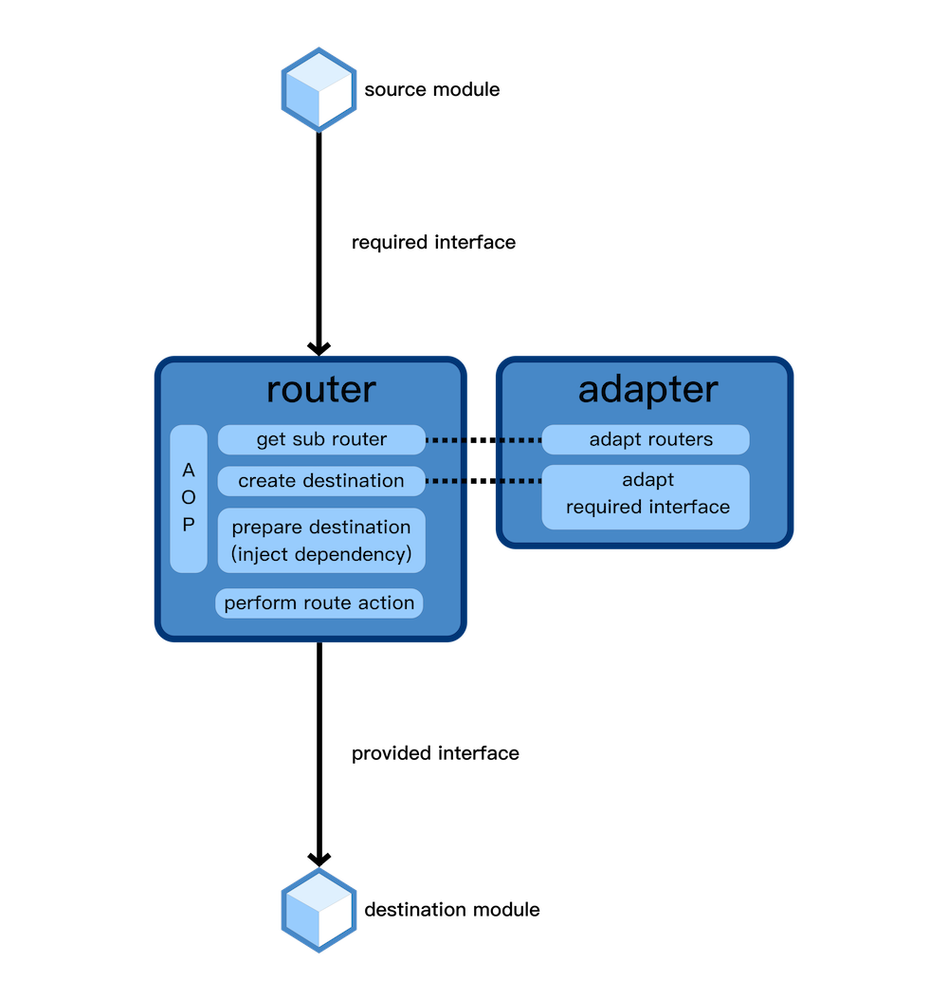

# 设计思想

## 基本架构

  
  数据流向图

## 设计思路

ZIKRouter 使用接口管理和使用模块。使用接口的优点：

* 依赖编译检查，实现严格的类型安全
* 利用编译检查，减少重构时的成本
* 通过接口检查，保证模块正确实现所提供的接口
* 通过接口明确声明模块所需的依赖，允许外部进行依赖注入
* 保持动态特性的同时，进行路由检查，避免使用不存在的路由模块
* 利用接口，区分 required protocol 和 provided protocol，进行明确的模块适配，实现彻底解耦

## 路由工具对比

相比其他路由工具和模块管理工具，ZIKRouter 有什么优势？

### URL Router

ZIKRouter 实现了基于接口的模块管理方式，而大部分路由工具都是基于 URL 实现的。

URL router 的优点：

* 极高的动态性
* 方便地统一管理多平台的路由规则
* 易于适配 URL Scheme

URL router 的缺点：

* 传参方式有限，并且无法利用编译器进行参数类型检查
* 只适用于界面模块，不适用于通用模块
* 不能使用 designated initializer 声明必需参数
* 要让 view controller 支持 url，需要为其新增初始化方法，因此需要对模块做出修改
* 不支持 storyboard
* 无法明确声明模块提供的接口，只能依赖于接口文档，重构时无法确保修改正确
* 依赖于字符串硬编码，难以管理
* 无法保证所使用的模块一定存在
* 无法区分required protocol 和 provided protocol，因此无法彻底解耦

#### ZIKRouter 的改进

通过接口管理模块，有效避免了 URL router 的缺点。参数可以通过 protocol 直接传递，能够利用编译器检查参数类型，并且 ZIKRouter 能通过路由声明和编译检查，保证所使用的模块一定存在。在为模块创建路由时，也无需修改模块的代码。

同时 ZIKRouter 可以通过字符串匹配 router，因此可以轻易地和其他 URL router 对接。

### 基于反射的模块管理工具

有一些模块管理工具基于 Objective-C 的 runtime、category 特性动态获取模块。例如通过`NSClassFromString`获取类并创建实例，通过`performSelector:` `NSInvocation`动态调用方法。

这些工具的实现思路，大致是利用 category 为路由工具添加新接口，在接口中通过字符串获取对应的类，再用 runtime 创建实例，动态调用实例的方法。

优点：

* 利用 category 可以明确声明接口，进行编译检查
* 实现方式轻量

缺点：

* 在 category 中仍然引入了字符串硬编码
* 无法保证所使用的模块一定存在
* 无法区分 required protocol 和 provided protocol，因此无法彻底解耦
* 过于依赖 runtime 特性，无法应用到纯 swift 上
* 使用 runtime 相关的接口调用任意类的任意方法，有被苹果审核拒绝的风险。参考：[Are performSelector and respondsToSelector banned by App Store?
](https://stackoverflow.com/questions/42662028/are-performselector-and-respondstoselector-banned-by-app-store)

#### ZIKRouter 的改进

ZIKRouter 避免使用 runtime 获取和调用模块，因此可以适配 OC 和 swift。同时，基于 protocol 匹配的方式，避免引入字符串硬编码，能够更好地管理模块。

### 基于 protocol 匹配的模块管理工具

有一些模块管理工具也实现了基于接口的管理方式。实现思路是将 protocol 和对应的类进行字典匹配，之后就可以用 protocol 获取 class，再动态创建实例。

#### ZIKRouter 的改进

这种方式和 ZIKRouter 的思路类似，但是不支持纯 Swift 类型，也不支持更详细的配置。 ZIKRouter 进行了进一步的改进，并不是直接对 protocol 和 class 进行匹配，而是将 protocol 和 router 子类进行匹配，在 router 子类中再提供创建模块的实例的方式。

加了一层 router 中间层之后，就可以让多个 protocol 和同一个模块进行匹配，也可以让模块进行接口适配，也能在 router 子类中进行更详细的依赖注入和自定义操作。

同时，ZIKRouter 也限制了路由的动态特性，只能用经过声明的 protocol 进行路由，防止使用不存在的模块。

## 架构图

## 博客详解

更详细的讲解，可以阅读这三篇博客：

[iOS VIPER架构实践(一)：从MVC到MVVM到VIPER](https://zuikyo.github.io/2017/07/21/iOS%20VIPER架构实践(一)：从MVC到MVVM到VIPER/)

[iOS VIPER架构实践(二)：VIPER详解与实现](https://zuikyo.github.io/2017/08/11/iOS%20VIPER架构实践(二)：VIPER详解与实现/)

[iOS VIPER架构实践(三)：面向接口的路由设计](https://zuikyo.github.io/2017/09/27/iOS%20VIPER架构实践(三)：基于接口的路由设计/)