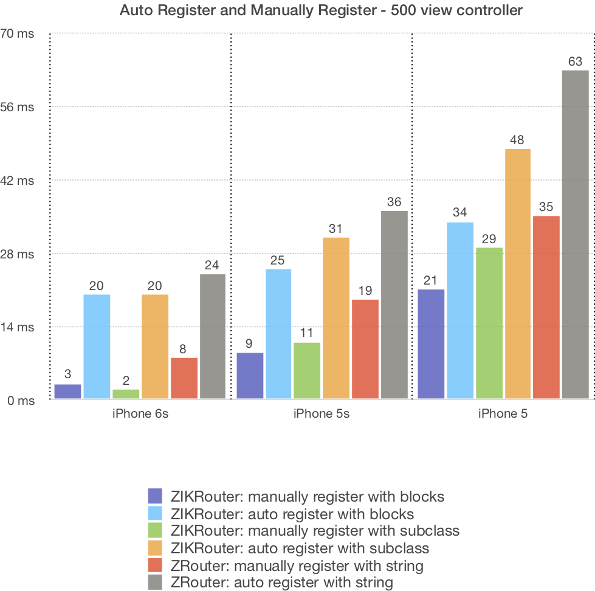
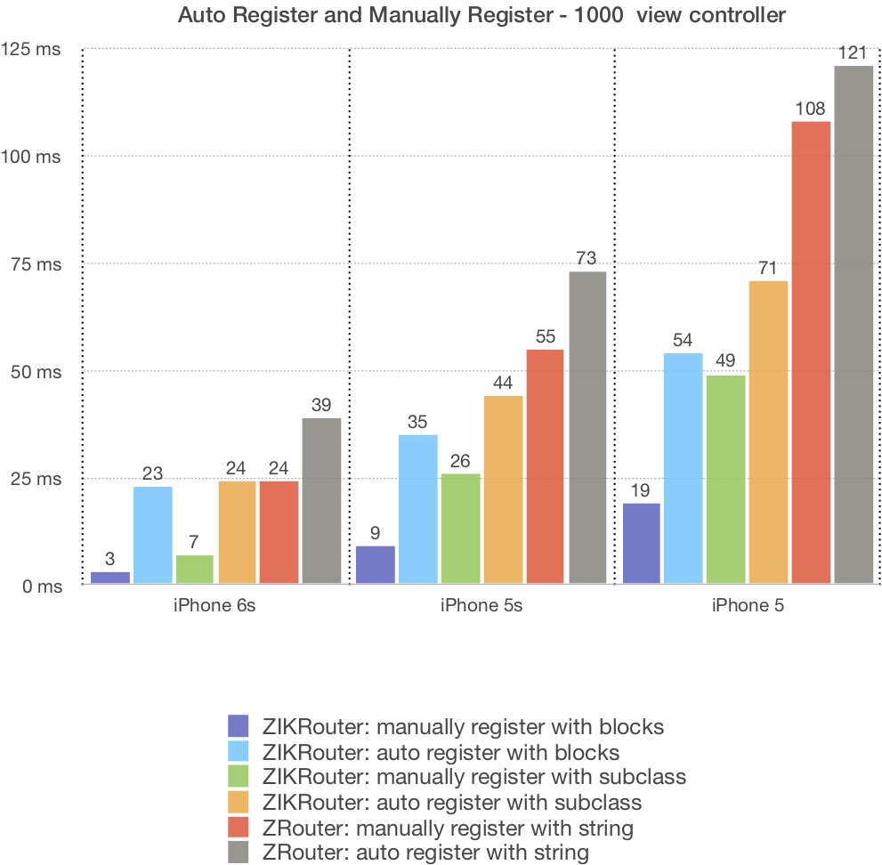
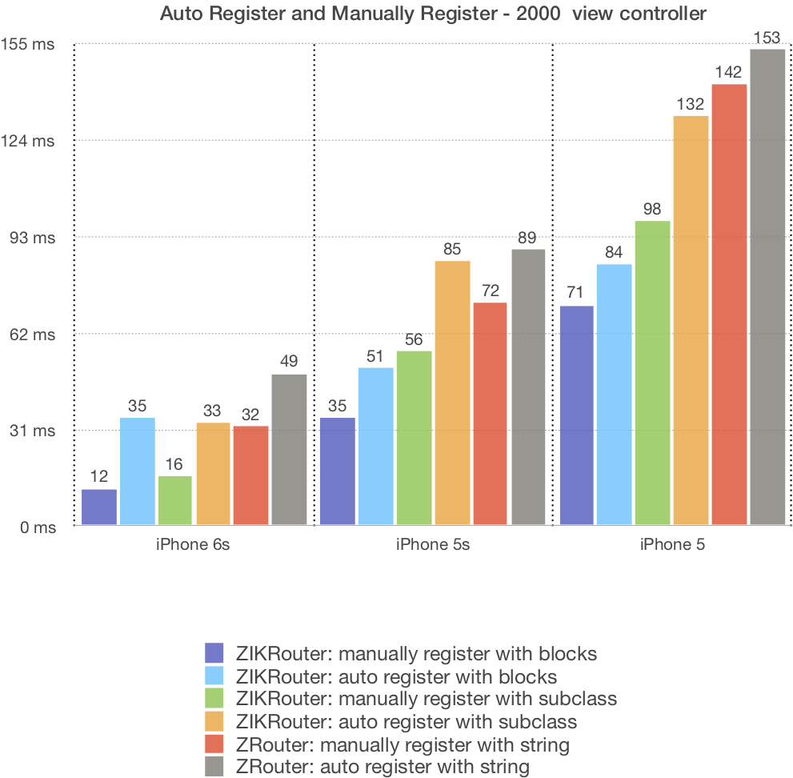
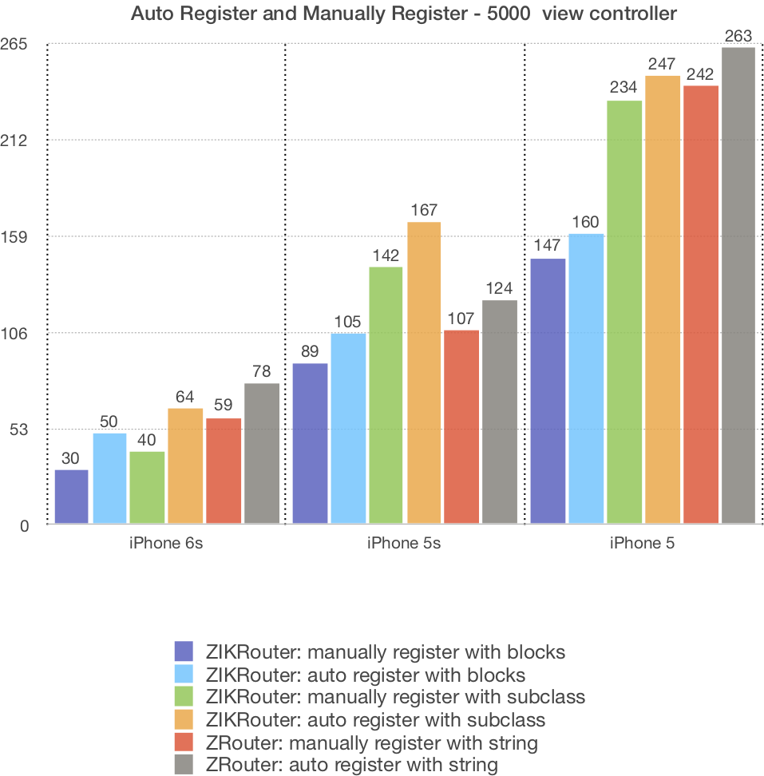
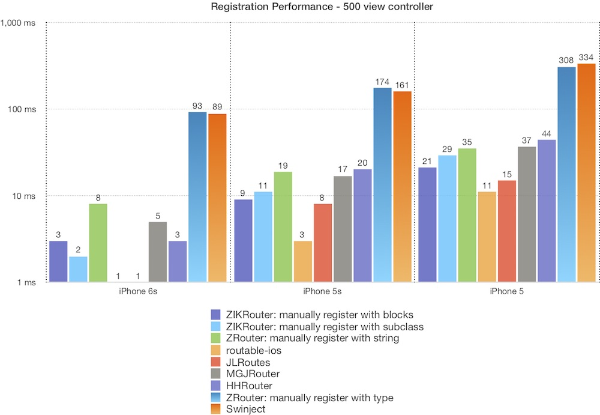
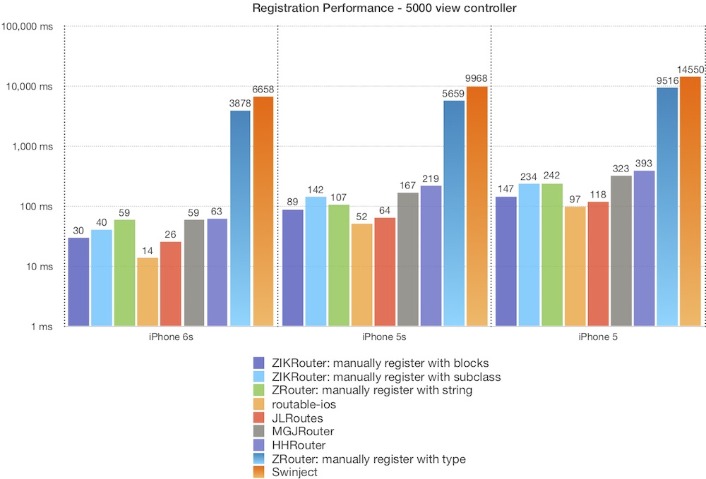

# 模块注册

在 router 里，你必须重写`registerRoutableDestination`方法，注册当前 router 所管理的类和用于动态路由的 protocol。App 启动时会自动执行所有 router 的`registerRoutableDestination`方法。

## 注册destination类

你可以为同一个类创建多个 router，例如`UIAlertController`，不同的模块可以对`UIAlertController`进行不同的功能封装，例如 A 模块创建了一个 alert router，用于同时兼容`UIAlertView`和`UIAlertController`，B 模块也创建了一个 alert router，只是用于封装 alert 控件。如果要区分使用两个 router，就需要分别注册不同的 protocol，并在使用时用各自的 protocol 获取路由。

```swift
class CommonAlertViewRouter: ZIKAnyViewRouter {
    override class func registerRoutableDestination() {
        registerView(UIAlertViewController.self)
        registerView(UIAlertView.self)
        register(RoutableView<CommonAlertViewInput>())
    }
}
```
```swift
class EasyAlertViewRouter: ZIKAnyViewRouter {
    override class func registerRoutableDestination() {
        registerView(UIAlertViewController.self)
        register(RoutableView<EasyAlertViewInput>())
    }
}
```

注册 destination 的目的一是为了进行错误检查，二是需要支持 storyboard，在注册表中寻找 view controller 对应的 router 进行配置。

## 独占性

当你为自己的模块创建 router，并且在 router 里进行依赖注入，这时就要求使用者必须使用你创建的 router，不能再创建其他 router。因此需要用`+registerExclusiveView:`来将模块和 router 进行单一注册。这时，其他 router 就不能再注册此模块了，否则在启动时会产生断言错误。

```swift
class EditorViewRouter: ZIKAnyViewRouter {
    override class func registerRoutableDestination() {
        registerExclusiveView(EditorViewController.self)
    }
}
```
当 router 里管理的 destination 是公有的时候，使用普通注册，例如 UIKit 里的公有类、第三方模块中未提供 router 的类。当 destination 是你自己拥有的，则使用独占式注册，限制路由的使用。

独占式注册的性能更好，因为无需处理多个 router 的情况。建议优先使用独占式注册。

## protocol 注册

你可以在注册 destination 的同时，注册 destination 的 protocol。之后就能用 protocol 来获取 router 类，无需引入 router 子类。如果没有注册 protocol，那么在使用时就只能明确地使用 router 的具体子类。

同时，在执行路由时，也可以用 protocol 对 destination 进行方法注入，实现动态传参。

### destination protocol

如果你的类很简单，所有的依赖注入都可以在 destination 上直接进行，那么只需要使用 destination protocol，只对 destination 类进行依赖注入。

### module protocol

如果 destination 是属于一个复杂模块，有多个组件类，而这些组件类的配置无法全部在一个 destination 类上进行，则应该使用 module config protocol，让 router 在内部初始化各个组件。例如需要向一个 VIPER 模块传递 model 对象，此时 destination 类是 VIPER 中的 View，而 View 在设计上不能接触到 model。此时就可以用 module config protocol 配置 router 的configuration，再在 router 内部用 configuration 去配置模块内的各个部分。

```swift
///模块配置协议
protocol EditorModuleConfig {
    var noteModel: Note?
}
///用自定义的 ZIKRouteConfiguration 子类保存模块配置
class EditorModuleConfiguration: ZIKViewRouteConfiguration, EditorModuleConfig {
    var noteModel: Note?
}

class EditorViewRouter: ZIKViewRouter<EditorViewController, EditorModuleConfiguration> {
    //注册当前 Router 所管理的 view 和 protocol
    override class func registerRoutableDestination() {
        registerView(EditorViewController.self)
        register(RoutableViewModule<EditorModuleConfig>())
    }
    //使用自定义模块配置
    override defaultConfiguration() -> EditorModuleConfiguration {
        return EditorModuleConfiguration()
    }
    
    //返回需要获取的目的模块
    override func destination(with configuration: EditorModuleConfiguration) -> EditorViewController? {
        let sb = UIStoryboard.init(name: "Main", bundle: nil)
        let destination = sb.instantiateViewController(withIdentifier: "EditorViewController") as! EditorViewController
        return destination
    }
    
    //在执行路由前配置模块，执行依赖注入
    override func prepareDestination(_ destination: EditorViewController, configuration: EditorModuleConfiguration) {
        //配置 VIPER 模块
        let view = destination
        guard view.presenter == nil else {
            return
        }
        let presenter = EditorPresenter()
        let interactor = EditorInteractor()
        
        //把 model 传递给 interactor
        interactor.note = configuration.noteModel
        
        presenter.interactor = interactor
        presenter.view = view
        view.presenter = presenter
    }
}

```

## 字符串 Identifier 注册

你可以给 router 注册一个字符串唯一码：

```swift
class EditorViewRouter: ZIKAnyViewRouter {
    override class func registerRoutableDestination() {
        registerIdentifier("viewController-editor")
    }
}
```

之后就能用这个唯一码获取模块：

```swift
var userInfo: [String : Any] = ... // 用字典传递参数
Router.to(viewIdentifier: "viewController-editor")?
	.perform(path: .push(from: self), configuring: { (config, _, _) in
    	config.addUserInfo(userInfo)
	})
```

字典传参无法检查参数类型，因此不建议在正常情况下使用。你应该只有在模块需要支持 URL scheme 时，才使用这种方式。用字符串匹配，可以让 ZIKRouter 和其他 URL router 兼容。

## 自动注册

App 启动时会遍历所有的类，自动执行所有 router 的`registerRoutableDestination`方法。

遍历所有 router 类的操作经过了深度优化，你不必担心性能问题。可以参考下面的性能测试，当你的模块超过了 2000 个，你可以尝试使用分阶段的手动注册。大部分情况下，你都不需要用到手动注册，因为自动注册的性能和手动注册几乎是一样的，区别只是在于手动注册可以分阶段进行，而不必一次性注册全部的模块。

## 手动注册

手动注册指的是逐一调用 router 的`registerRoutableDestination`方法。你可以将一部分尚未用到的 router 延后注册。

### 1. 关闭自动注册

```objectivec
// 在 +load 中关闭自动注册, 只要在 UIApplicationMain 执行前关闭即可
+ (void)load {
    ZIKRouteRegistry.autoRegister = NO;
    [self registerForModulesBeforeRegistrationFinished];
}

+ (void)registerForModulesBeforeRegistrationFinished {
    // 注册那些在初始界面中就使用到的模块
}

```

在手动注册时，有可能会发生模块在注册之前就要被使用的情况。比如有些模块在初始界面中就要使用。这时就需要让这些模块提早注册。如果在未完成全部注册前出现了查找失败的情况，ZIKRouter 会给出断言错误。

### 2. 注册模块

之后，在适当时间逐一注册每个 router:

```objectivec
@import ZIKRouter.Internal;
#import "EditorViewRouter.h"

+ (void)registerRoutes {
    [EditorViewRouter registerRoutableDestination];
    ...
    // 结束注册
    [ZIKRouteRegistry notifyRegistrationFinished];
}

```

你可以用这两个函数自动生成 import router 头文件的代码和注册 router 的代码:

```swift
import ZIKRouter.Private

let importCode = codeForImportRouters()
let registeringCode = codeForRegisteringRouters()
```

```objectivec
@import ZIKRouter.Private;

NSString *importCode = codeForImportRouters();
NSString *registeringCode = codeForRegisteringRouters();
```

## 性能测试

你可能会怀疑模块注册可能会对性能产生影响，接下来的性能测试将会打消你的这部分疑虑。

### 自动注册和手动注册

下面对自动注册和手动注册的性能进行比较测试：

* 分别测试 500、1000、2000、5000 个 view controller ，在自动注册和手动注册时的耗时
* 用`+registerExclusiveView:`和`+registerViewProtocol:`注册
* `ZIKRouter: register with blocks`指的是用轻量级的 ZIKViewRoute 进行注册，由于类的数量比使用 router 子类时少，因此性能稍好，缺点是内存占用会变大
* `ZIKRouter: register with subclass`指的是用 router 子类进行注册
* `ZRouter: register with string`指的是用`init(declaredTypeName:)`声明并注册纯 swift 的 protocol；由于 ZRouter 需要支持 objc protocol 和纯 swift protocol，因此性能会比 ZIKRouter 稍微降低

**Update:**这是优化前的测试结果，现在自动注册已经和手动注册的性能几乎一致了，之后有时间会更新图表。

<p align="center">
  
</p>

<p align="center">
  
</p>

<p align="center">
  
</p>

<p align="center">
  
</p>

在 64 位机型上完全没有性能问题，在 32 位老机型上耗时会比较多，而大部分耗时都是在 objc 的方法调用上，经测试，即便把注册方法都替换为空方法，耗时也是差不多的。

如果你的项目需要支持 32 位机型，而且需要注册的模块超过了 1000 个，可以关闭自动注册，使用分阶段的手动注册。不过这种情况应该很少，因为即便是庞大如微信，其 view controller 的数量也只有 7 百多个。

### 和其他 router 库的性能比较

下面和其他 router 库进行性能比较：

* 分别测试 500、1000、2000、5000 个 view controller ，在手动注册时的耗时
* 用`+registerExclusiveView:`和`+registerViewProtocol:`注册
* `ZRouter: register with type`指的是用`init(declaredProtocol:)`声明并注册纯 swift 的 protocol
* 其他 URL router 注册对应数量的`/user/TestViewControllerxxx/:userID`格式的 url

<p align="center">
  
</p>

<p align="center">
  
</p>

<p align="center">
  
</p>

<p align="center">
  
</p>

测试结果：

* 性能最好的是`routable-ios`和`JLRoutes`，其次就是 ZIKRouter 和 ZRouter
* MGJRouter 和 HHRouter 在注册时会对字符串进行一些处理，导致性能略微下降
* 在 Swift 环境下的`ZRouter: register with type`和 Swinject 的耗时大大超出了其他方式，原因是使用了`String(describing:)`将 swift type 转为字符串，但是`String(describing:)`的性能很差
* 使用`Zrouter: register with string`可以轻易地大幅提升`ZRouter`的性能，原因就是避免了使用`String(describing:)`

经过上面的性能测试，我的结论是，无需考虑注册时的性能问题。

---
#### 下一节：[Routable声明](./RoutableDeclaration.md)