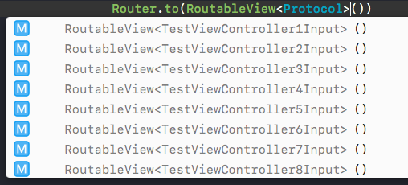

# Routable

When registering destination and protocol, you need to declare the destination and protocol as routable. You only need to add some extensions. Routable declaration is for making dynamic routing much safer.

## Routable destination

Add `ZIKRoutableView` extension for destination in view router:

```swift
extension EditorViewController: ZIKRoutableView {

}
```

<details><summary>Objective-C Sample</summary>

```objectivec
@interface EditorViewController(EditorViewRouter)<ZIKRoutableView>
@end
@implementation EditorViewController(EditorViewRouter)
@end
```

Or use convenient macro:

```objectivec
DeclareRoutableView(EditorViewController, EditorViewRouter)
```

</details>

The routable declaration here is for supporting storyboard. When a segue is performed and the UIViewController is routable, ZIKRouter will search its view router and prepare it.

## Routable protocol

When you try to get a router with a protocol, the protocol must be routable.

There're several levels to make dynamic routing. In Swift and Objective-C, routable declarations are different.

### Routable in Swift

In Swift, protocol is designated as struct's generic parameter:

```swift
public struct RoutableView<Protocol> {
    @available(*, unavailable, message: "Protocol is not declared as routable")
    public init() { }
    
    /// Only use this in initializers in extension, never use it in other place. The protocol must be declared in extension.
    public init(declaredProtocol: Protocol.Type) { }
}
```

Declare that `SwiftEditorViewInput` is routable, and can only be used for view routing:

```swift
extension RoutableView where Protocol == SwiftEditorViewInput {
    //Can access to initializer when generic is SwiftEditorViewInput
    init() { self.init(declaredProtocol: Protocol.self) }
}
```

`RoutableView`'s initializer is not public, only explicitly declared protocol can be used to create `RoutableView`, like `RoutableView<SwiftEditorViewInput>()`:

```swift
class TestViewController: UIViewController {
    func showEditor() {
        Router.perform(
            to: RoutableView<SwiftEditorViewInput>(),
            path: .push(from: self)
            )
    }
}
```

If you pass a wrong protocol, such as `RoutableView<UnroutableProtocol>()`, there will be a compile error.

The `init(declaredProtocol: Protocol.Type)` is only to silence the warning of `initializer for struct 'xxx' must use "self.init(...)" or "self = ..." because it is not in module xxx`. See [restrict-cross-module-struct-initializers](https://github.com/apple/swift-evolution/blob/master/proposals/0189-restrict-cross-module-struct-initializers.md). You should only use it in extension. If you use wrong type with these initializer, there will be assert failure when registration is finished.

Now, Xcode will auto list all declared protocols when routing:



### Composed Protocol

You can declared with a composed protocol:


```swift
extension RoutableView where Protocol == UIViewController & EditorViewInput {
    //Can access to initializer when generic is UIViewController & EditorViewInput
    init() { self.init(declaredProtocol: Protocol.self) }
}
```

You can also use typealias:

```swift
typealias RequiredEditorViewInput = UIViewController & EditorViewInput
```
Then use it as:

```swift
Router.perform(
            to: RoutableView<RequiredEditorViewInput>(),
            path: .push(from: self),
            configuring: { (config, prepareDestiantion, _) in
                prepareDestination({ destination in
                    // destination is inferred as UIViewController & EditorViewInput
                    // don't need to cast it to UIViewController
                })
        })
        
let destination = Router.makeDestination(to: RoutableView<RequiredEditorViewInput>())
// destination is inferred as UIViewController & EditorViewInput
```

With composed protocol, you can designate multi types for the destination, and don't need to do type casting when you need to use destination as an UIViewControler.

### Routable in Objective-C

Swift is type safe, but Objective-C is not. In Objective-C, ZIKRouter uses another way to declare routable protocols.

#### `ZIKViewRoutable` and `ZIKServiceRoutable`

When a protocol is for view routing, the protocol should inherit from `ZIKViewRoutable`.

```objectivec
@protocol EditorViewInput <ZIKViewRoutable>
@property (nonatomic, copy) NSString *editorTitle;
@end
```

When a protocol is for service routing, the protocol should inherit from `ZIKServiceRoutable`.

#### `ZIKViewModuleRoutable` and `ZIKServiceModuleRoutable`

When a protocol is a view module config protocol, the protocol should inherit from `ZIKViewModuleRoutable`.

```objectivec
@protocol EditorModuleInput <ZIKViewModuleRoutable>
@property (nonatomic, copy) NSString *editorTitle;
@end
```

When a protocol is a service module config protocol, the protocol should inherit from `ZIKServiceModuleRoutable`.

#### Runtime Checking

If you declare a routable protocol, but didn't register it with any router, there will be assert failure.

When app is launched and in DEBUG mode, ZIKRouter will enumerate all objc protocols inheriting form `ZIKViewRoutable`,`ZIKServiceRoutable `,`ZIKViewModuleRoutable` and `ZIKServiceModuleRoutable`, to check whether all protocols were registered with a router, and the router's destination or defaultConfiguration conforms to the protocol.

Even for pure swift type, ZIKRouter can dynamically enumerate all declared protocols and check its conformance. It uses private APIs in `libswiftCore.dylib`, and these code won't be compiled in release mode.

Protocols inheriting from `ZIKViewRoutable`,`ZIKServiceRoutable `,`ZIKViewModuleRoutable` and `ZIKServiceModuleRoutable` is also routable in Swift. You don't need to declare them in Swift again.

More details about type checking: [Type Checking](TypeChecking.md).

---
#### Next section: [Type Checking](TypeChecking.md)