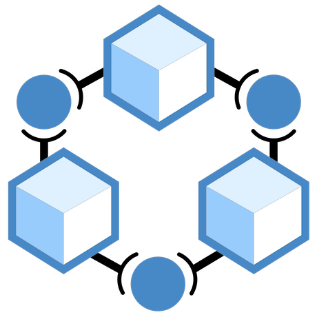
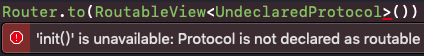
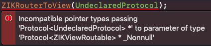
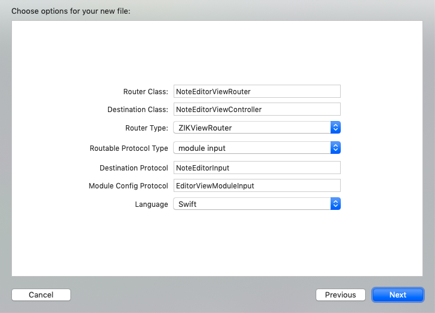

<p align="center">
  
</p>

# ZIKRouter


An interface-oriented router for managing modules and injecting dependencies with protocol.

The view router can perform all navigation types in UIKit / AppKit through one method.

The service router can discover and prepare corresponding module with its protocol.

---

一个用于模块间解耦和通信，基于接口进行模块管理和依赖注入的组件化路由工具。用多种方式最大程度地发挥编译检查的功能。

通过 protocol 寻找对应的模块，并用 protocol 进行依赖注入和模块通信。

Service Router 可以管理任意自定义模块。View Router 进一步封装了界面跳转。

### [中文文档](Documentation/Chinese/README.md)

---

## Features

- [x] Swift and Objective-C support
- [x] iOS, macOS and tvOS support
- [x] File template for quickly creating router
- [x] Routing for UIViewController / NSViewController, UIView / NSView and any class
- [x] Dependency injection, including dynamic injection and static injection
- [x] **Declaration of routable protocol for compile-time checking. Using undeclared protocol will bring compiler error. This is one of the most powerful feature**
- [x] **Module matching with its protocol**
- [x] **URL routing support**
- [x] **Configure the module with its protocol rather than a parameter dictionary**
- [x] **Required protocol and provided protocol for making thorough decouple**
- [x] **Adapter for decoupling modules and add compatible interfaces**
- [x] **Storyboard support. Views from a segue can be auto prepared**
- [x] Encapsulation for all transition methods and unwind methods in UIKit / AppKit, and also custom transition
- [x] Error checking for view transition
- [x] AOP for view transition
- [x] Memory leak detection
- [x] Custom events handling
- [x] Auto registration
- [x] Highly scalable

## Quick Start Guide

1. [Create Router](#1-Create-Router)
   1. [Router Subclass](#11-Router-Subclass)
   2. [Simple Router](#12-Simple-Router)
2. [Declare Routable Type](#2-Declare-Routable-Type)
3. [View Router](#View-Router)
   1. [Transition directly](#Transition-directly)
   2. [Prepare before Transition](#Prepare-before-Transition)
   3. [Make Destination](#Make-Destination)
   4. [Required Parameter and Special Parameter](#Required-Parameter-and-Special-Parameter)
   5. [Perform on Destination](#Perform-on-Destination)
   6. [Prepare on Destination](#Prepare-on-Destination)
   7. [Remove](#Remove)
   8. [Adapter](#Adapter)
   9. [Modularization](#Modularization)
   10. [URL Router](#URL-Router)
   11. [Other Features](#Other-Features)
4. [Service Router](#Service-Router)
5. [Demo and Practice](#Demo-and-Practice)
6. [File Template](#File-Template)

## Documentation

### Design Idea

[Design Idea](Documentation/English/DesignPhilosophy.md)

### Basics

1. [Router Implementation](Documentation/English/RouterImplementation.md)
2. [Module Registration](Documentation/English/ModuleRegistration.md)
3. [Routable Declaration](Documentation/English/RoutableDeclaration.md)
4. [Type Checking](Documentation/English/TypeChecking.md)
5. [Perform Route](Documentation/English/PerformRoute.md)
6. [Remove Route](Documentation/English/RemoveRoute.md)
7. [Transfer Parameters with Custom Configuration](Documentation/English/CustomConfiguration.md)

### Advanced Features

1. [Error Handle](Documentation/English/ErrorHandle.md)
2. [Storyboard and Auto Create](Documentation/English/Storyboard.md)
3. [AOP](Documentation/English/AOP.md)
4. [Dependency Injection](Documentation/English/DependencyInjection.md)
5. [Circular Dependency](Documentation/English/CircularDependencies.md)
6. [Module Adapter](Documentation/English/ModuleAdapter.md)
7. [Unit Test](Documentation/English/UnitTest.md)

[FAQ](Documentation/English/FAQ.md)

## Requirements

* iOS 7.0+
* Swift 3.2+
* Xcode 9.0+

## Installation

### Cocoapods

Add this to your Podfile.

For Objective-C project:

```
pod 'ZIKRouter', '>= 1.1.1'

# or only use ServiceRouter
pod 'ZIKRouter/ServiceRouter' , '>=1.1.1'
```
For Swift project:

```
pod 'ZRouter', '>= 1.1.1'

# or only use ServiceRouter
pod 'ZRouter/ServiceRouter' , '>=1.1.1'
```

### Carthage

Add this to your Cartfile:

```
github "Zuikyo/ZIKRouter" >= 1.1.1
```

Build frameworks:

```
carthage update
```

Build DEBUG version to enable route checking:

```
carthage update --configuration Debug
```
Remember to use release version in production environment.

For Objective-C project, use `ZIKRouter.framework`. For Swift project, use `ZRouter.framework`.

## Getting Started

This is the demo view controller and protocol：

```swift
///Editor view's interface
protocol EditorViewInput: class {
    weak var delegate: EditorDelegate? { get set }
    func constructForCreatingNewNote()
}

///Editor view controller
class NoteEditorViewController: UIViewController, EditorViewInput {
    ...
}
```

<details><summary>Objective-C Sample</summary>

```objectivec
///editor view's interface
@protocol EditorViewInput <ZIKViewRoutable>
@property (nonatomic, weak) id<EditorDelegate> delegate;
- (void)constructForCreatingNewNote;
@end
```

```objectivec
///Editor view controller
@interface NoteEditorViewController: UIViewController <EditorViewInput>
@end
@implementation NoteEditorViewController
@end
```

</details>


There're 2 steps to create route for your module.

### 1. Create Router

To make your class become modular, you need to create router for your module. You don't need to modify the module's code. That will reduce the cost for refactoring existing modules.

#### 1.1 Router Subclass

Create router subclass for your module:

```swift
import ZIKRouter.Internal
import ZRouter

class NoteEditorViewRouter: ZIKViewRouter<NoteEditorViewController, ViewRouteConfig> {
    override class func registerRoutableDestination() {
        // Register class with this router. A router can register multi views, and a view can be registered with multi routers
        registerView(NoteEditorViewController.self)
        // Register protocol. Then we can fetch this router with the protocol
        register(RoutableView<EditorViewInput>())
    }
    
    // Return the destination module
    override func destination(with configuration: ViewRouteConfig) -> NoteEditorViewController? {
        // In configuration, you can get parameters from the caller for creating the instance
        let destination: NoteEditorViewController? = ... /// instantiate your view controller
        return destination
    }
    
    override func prepareDestination(_ destination: NoteEditorViewController, configuration: ViewRouteConfig) {
        // Inject dependencies to destination
    }
}
```

<details><summary>Objective-C Sample</summary>

```objectivec
//NoteEditorViewRouter.h
@import ZIKRouter;

@interface NoteEditorViewRouter : ZIKViewRouter
@end

//NoteEditorViewRouter.m
@import ZIKRouter.Internal;

@implementation NoteEditorViewRouter

+ (void)registerRoutableDestination {
    // Register class with this router. A router can register multi views, and a view can be registered with multi routers
    [self registerView:[NoteEditorViewController class]];
    // Register protocol. Then we can fetch this router with the protocol
    [self registerViewProtocol:ZIKRoutable(EditorViewInput)];
}

// Return the destination module
- (NoteEditorViewController *)destinationWithConfiguration:(ZIKViewRouteConfiguration *)configuration {
    // In configuration, you can get parameters from the caller for creating the instance 
    NoteEditorViewController *destination = ... // instantiate your view controller
    return destination;
}

- (void)prepareDestination:(NoteEditorViewController *)destination configuration:(ZIKViewRouteConfiguration *)configuration {
    // Inject dependencies to destination
}

@end
```

</details>

Each router can control their own routing, such as using different custom transition. And the router can be very easy to add additional features.

Read the documentation for more details and more methods to override.

#### 1.2 Simple Router

If your module is very simple and don't need a router subclass, you can just register the class in a simpler way:

```swift
ZIKAnyViewRouter.register(RoutableView<EditorViewInput>(), forMakingView: NoteEditorViewController.self)
```

<details><summary>Objective-C Sample</summary>

```objectivec
[ZIKViewRouter registerViewProtocol:ZIKRoutable(EditorViewInput) forMakingView:[NoteEditorViewController class]];
```

</details>

or with custom creating block:

```swift
ZIKAnyViewRouter.register(RoutableView<EditorViewInput>(), 
                 forMakingView: NoteEditorViewController.self) { (config, router) -> EditorViewInput? in
                     let destination: NoteEditorViewController? = ... // instantiate your view controller
                     return destination;
        }

```

<details><summary>Objective-C Sample</summary>

```objectivec
[ZIKViewRouter
    registerViewProtocol:ZIKRoutable(EditorViewInput)
    forMakingView:[NoteEditorViewController class]
    making:^id _Nullable(ZIKViewRouteConfiguration *config, ZIKViewRouter *router) {
        NoteEditorViewController *destination = ... // instantiate your view controller
        return destination;
 }];
```

</details>

or with custom factory function:

```swift
function makeEditorViewController(config: ViewRouteConfig) -> EditorViewInput? {
    let destination: NoteEditorViewController? = ... // instantiate your view controller
    return destination;
}

ZIKAnyViewRouter.register(RoutableView<EditorViewInput>(), 
                 forMakingView: NoteEditorViewController.self, making: makeEditorViewController)
```

<details><summary>Objective-C Sample</summary>

```objectivec
id<EditorViewInput> makeEditorViewController(ZIKViewRouteConfiguration *config) {
    NoteEditorViewController *destination = ... // instantiate your view controller
    return destination;
}

[ZIKViewRouter
    registerViewProtocol:ZIKRoutable(EditorViewInput)
    forMakingView:[NoteEditorViewController class]
    factory:makeEditorViewController];
```

</details>

### 2. Declare Routable Type

The declaration is for checking routes at compile time, and supporting storyboard.

```swift
// Declare NoteEditorViewController is routable
// This means there is a router for NoteEditorViewController
extension NoteEditorViewController: ZIKRoutableView {
}

// Declare EditorViewInput is routable
// This means you can use EditorViewInput to fetch router
extension RoutableView where Protocol == EditorViewInput {
    init() { self.init(declaredProtocol: Protocol.self) }
}
```

<details><summary>Objective-C Sample</summary>

```objectivec
// Declare NoteEditorViewController is routable
// This means there is a router for NoteEditorViewController
DeclareRoutableView(NoteEditorViewController, NoteEditorViewRouter)

// If the protocol inherits from ZIKViewRoutable, it's routable
// This means you can use EditorViewInput to fetch router
@protocol EditorViewInput <ZIKViewRoutable>
@property (nonatomic, weak) id<EditorDelegate> delegate;
- (void)constructForCreatingNewNote;
@end
```

</details>

**If you use an undeclared protocol for routing, there will be compile time error. So it's much safer and easier to manage protocols and to know which protocols are routable.**

Unroutable error in Swift:



Unroutable error in Objective-C:



Now you can get and show `NoteEditorViewController` with router.

### View Router

#### Transition directly

Transition to editor view directly:

```swift
class TestViewController: UIViewController {

    // Transition to editor view directly
    func showEditorDirectly() {
        Router.perform(to: RoutableView<EditorViewInput>(), path: .push(from: self))
    }
}
```

<details><summary>Objective-C Sample</summary>

```objectivec
@implementation TestViewController

- (void)showEditorDirectly {
    // Transition to editor view directly
    [ZIKRouterToView(EditorViewInput) performPath:ZIKViewRoutePath.pushFrom(self)];
}

@end
```

</details>

You can change transition type with `ViewRoutePath`:

```swift
enum ViewRoutePath {
    case push(from: UIViewController)
    case presentModally(from: UIViewController)
    case presentAsPopover(from: UIViewController, configure: ZIKViewRoutePopoverConfigure)
    case performSegue(from: UIViewController, identifier: String, sender: Any?)
    case show(from: UIViewController)
    case showDetail(from: UIViewController)
    case addAsChildViewController(from: UIViewController, addingChildViewHandler: (UIViewController, @escaping () -> Void) -> Void)
    case addAsSubview(from: UIView)
    case custom(from: ZIKViewRouteSource?)
    case makeDestination
    case extensible(path: ZIKViewRoutePath)
}
```

Encapsulating view transition can hide the UIKit detail, then you can perform route outside the view layer (presenter, view model, interactor, service) and be cross-platform.

#### Prepare before Transition

Prepare it before transition to editor view:

```swift
class TestViewController: UIViewController {

    // Transition to editor view, and prepare the destination with EditorViewInput
    func showEditor() {
        Router.perform(
            to: RoutableView<EditorViewInput>(),
            path: .push(from: self),
            configuring: { (config, _) in
                // Route config
                // Prepare the destination before transition
                config.prepareDestination = { [weak self] destination in
                    //destination is inferred as EditorViewInput
                    destination.delegate = self
                    destination.constructForCreatingNewNote()
                }
                config.successHandler = { destination in
                    // Transition succeed
                }
                config.errorHandler = { (action, error) in
                    // Transition failed
                }                
        })
    }
}
```

<details><summary>Objective-C Sample</summary>

```objectivec
@implementation TestViewController

- (void)showEditor {
    // Transition to editor view, and prepare the destination with EditorViewInput
    [ZIKRouterToView(EditorViewInput)
	     performPath:ZIKViewRoutePath.pushFrom(self)
	     configuring:^(ZIKViewRouteConfig *config) {
	         // Route config
	         // Prepare the destination before transition
	         config.prepareDestination = ^(id<EditorViewInput> destination) {
	             destination.delegate = self;
	             [destination constructForCreatingNewNote];
	         };
	         config.successHandler = ^(id<EditorViewInput> destination) {
	             // Transition is completed
	         };
	         config.errorHandler = ^(ZIKRouteAction routeAction, NSError * error) {
	             // Transition failed
	         };
	     }];
}

@end
```

</details>

For more detail, read [Perform Route](Documentation/English/PerformRoute.md).

#### Make Destination

If you don't want to show a view, but only need to get instance of the module, you can use `makeDestination`:

```swift
// destination is inferred as EditorViewInput
let destination = Router.makeDestination(to: RoutableView<EditorViewInput>())
```

<details><summary>Objective-C Sample</summary>

```objectivec
id<EditorViewInput> destination = [ZIKRouterToView(EditorViewInput) makeDestination];
```
</details>

#### Required Parameter and Special Parameter

Some parameters can't be delivered though destination's protocol:

* the destination class uses custom initializers to create instance, router needs to get required parameter from the caller

* the module contains multi components, and you need to pass parameters to those components. Those parameters do not belong to the destination, so they should not exist in destination's protocol

You can use module config protocol and a custom configuration to transfer parameters.

Instead of  `EditorViewInput`, we use another routable protocol `EditorViewModuleInput`  as config protocol for routing:

```swift
// In general, a module config protocol only contains `makeDestinationWith`, for declaring parameters and destination type. You can also add other properties or methods
protocol EditorViewModuleInput: class {
    // Factory method for transferring parameters and making destination
    var makeDestinationWith: (_ note: Note) -> EditorViewInput? { get }
}
```

<details><summary>Objective-C Sample</summary>

```objectivec
// In general, a module config protocol only contains `makeDestinationWith`, for declaring parameters and destination type. You can also add other properties or methods
@protocol EditorViewModuleInput <ZIKViewModuleRoutable>
 // Factory method for transferring parameters and making destination
@property (nonatomic, copy, readonly) id<EditorViewInput> _Nullable(^makeDestinationWith)(Note *note);
@end
```

</details>

This configuration works like a factory for the destination with `EditorViewModuleInput` protocol. It declares parameters for creating the destination.

Now the user can use the module with its module config protocol and transfer parameters:

```swift
var note = ...
Router.makeDestination(to: RoutableViewModule<EditorViewModuleInput>()) { (config) in
     // Transfer parameters and get EditorViewInput
     let destination = config.makeDestinationWith(note)
}
```

<details><summary>Objective-C Sample</summary>

```objectivec
Note *note = ...
[ZIKRouterToViewModule(EditorViewModuleInput)
    performPath:ZIKViewRoutePath.showFrom(self)
    configuring:^(ZIKViewRouteConfiguration<EditorViewModuleInput> *config) {
        // Transfer parameters and get EditorViewInput
        id<EditorViewInput> destination = config.makeDestinationWith(note);
 }];
```

</details>

For more detail, read [Transfer Parameters with Custom Configuration](Documentation/English/CustomConfiguration.md).

#### Perform on Destination

If you get a destination from other place, you can perform on the destination with its router.

For example, an UIViewController supports 3D touch, and implments `UIViewControllerPreviewingDelegate`:

```swift
class SourceViewController: UIViewController, UIViewControllerPreviewingDelegate {
    func previewingContext(_ previewingContext: UIViewControllerPreviewing, viewControllerForLocation location: CGPoint) -> UIViewController? {
        // Return the destination UIViewController to let system preview it
        let destination = Router.makeDestination(to: RoutableView<EditorViewInput>())
        return destination
    }
    
    func previewingContext(_ previewingContext: UIViewControllerPreviewing, commit viewControllerToCommit: UIViewController) {
        guard let destination = viewControllerToCommit as? EditorViewInput else {
            return
        }
        // Show the destination
        Router.to(RoutableView<EditorViewInput>())?.perform(onDestination: destination, path: .presentModally(from: self))
}

```

<details><summary>Objective-C Sample</summary>

```objectivec
@implementation SourceViewController

- (nullable UIViewController *)previewingContext:(id <UIViewControllerPreviewing>)previewingContext viewControllerForLocation:(CGPoint)location {
    //Return the destination UIViewController to let system preview it
    UIViewController<EditorViewInput> *destination = [ZIKRouterToView(EditorViewInput) makeDestination];
    return destination;
}

- (void)previewingContext:(id <UIViewControllerPreviewing>)previewingContext commitViewController:(UIViewController *)viewControllerToCommit {
    // Show the destination
    UIViewController<EditorViewInput> *destination;
    if ([viewControllerToCommit conformsToProtocol:@protocol(EditorViewInput)]) {
        destination = viewControllerToCommit;
    } else {
        return;
    }
    [ZIKRouterToView(EditorViewInput) performOnDestination:destination path:ZIKViewRoutePath.presentModallyFrom(self)];
}

@end
```

</details>

#### Prepare on Destination

If you don't want to show the destination, but just want to prepare an existing destination, you can prepare the destination with its router.

If the router injects dependencies inside it, this can properly setting the destination instance.

```swift
var destination: DestinationViewInput = ...
Router.to(RoutableView<EditorViewInput>())?.prepare(destination: destination, configuring: { (config, _) in
            config.prepareDestination = { destination in
                // Prepare
            }
        })

```

<details><summary>Objective-C Sample</summary>

```objectivec
UIViewController<EditorViewInput> *destination = ...
[ZIKRouterToView(EditorViewInput) prepareDestination:destination configuring:^(ZIKViewRouteConfiguration *config) {
            config.prepareDestination = ^(id<EditorViewInput> destination) {
                // Prepare
            };
        }];
```

</details>

#### Remove

You can remove the view by `removeRoute`, without using pop / dismiss / removeFromParentViewController / removeFromSuperview:

```swift
class TestViewController: UIViewController {
    var router: DestinationViewRouter<EditorViewInput>?
    
    func showEditor() {
        // Hold the router
        router = Router.perform(to: RoutableView<EditorViewInput>(), path: .push(from: self))
    }
    
    // Router will pop the editor view controller
    func removeEditorDirectly() {
        guard let router = router, router.canRemove else {
            return
        }
        router.removeRoute()
        router = nil
    }
    
    func removeEditorWithResult() {
        guard let router = router, router.canRemove else {
            return
        }
        router.removeRoute(successHandler: {
            print("remove success")
        }, errorHandler: { (action, error) in
            print("remove failed, error: \(error)")
        })
        router = nil
    }
    
    func removeEditorAndPrepare() {
        guard let router = router, router.canRemove else {
            return
        }
        router.removeRoute(configuring: { (config) in
            config.animated = true
            config.prepareDestination = { destination in
                // Use destination before remove it
            }
        })
        router = nil
    }
}
```

<details><summary>Objective-C Sample</summary>

```objectivec
@interface TestViewController()
@property (nonatomic, strong) ZIKDestinationViewRouter(id<EditorViewInput>) *router;
@end
@implementation TestViewController

- (void)showEditorDirectly {
    // Hold the router
    self.router = [ZIKRouterToView(EditorViewInput) performPath:ZIKViewRoutePath.pushFrom(self)];
}

// Router will pop the editor view controller
- (void)removeEditorDirectly {
    if (![self.router canRemove]) {
        return;
    }
    [self.router removeRoute];
    self.router = nil;
}

- (void)removeEditorWithResult {
    if (![self.router canRemove]) {
        return;
    }
    [self.router removeRouteWithSuccessHandler:^{
        NSLog(@"pop success");
    } errorHandler:^(ZIKRouteAction routeAction, NSError *error) {
        NSLog(@"pop failed,error: %@",error);
    }];
    self.router = nil;
}

- (void)removeEditorAndPrepare {
    if (![self.router canRemove]) {
        return;
    }
    [self.router removeRouteWithConfiguring:^(ZIKViewRemoveConfiguration *config) {
        config.animated = YES;
        config.prepareDestination = ^(UIViewController<EditorViewInput> *destination) {
            // Use destination before remove it
        };
    }];
    self.router = nil;
}

@end
```

</details>

For more detail, read [Remove Route](Documentation/English/RemoveRoute.md).

### Adapter

You can use another protocol to get router, as long as the protocol provides the same interface of the real protocol. Even the protocol is little different from the real protocol, you can  adapt two protocols with category, extension and proxy.

Required protocol used by the user:

```swift
/// Required protocol to use editor module
protocol RequiredEditorViewInput: class {
    weak var delegate: EditorDelegate? { get set }
    func constructForCreatingNewNote()
}
```

<details><summary>Objective-C Sample</summary>

```objectivec
/// Required protocol to use editor module
@protocol RequiredEditorViewInput <ZIKViewRoutable>
@property (nonatomic, weak) id<EditorDelegate> delegate;
- (void)constructForCreatingNewNote;
@end
```

</details>

In the host app context, connect required protocol and provided protocol:
```swift
/// In the host app, add required protocol to editor router
class EditorViewAdapter: ZIKViewRouteAdapter {
    override class func registerRoutableDestination() {
        // If you can get the router, you can just register RequiredEditorViewInput to it
        NoteEditorViewRouter.register(RoutableView<RequiredEditorViewInput>())
        
        // If you don't know the router, you can use adapter
        register(adapter: RoutableView<RequiredEditorViewInput>(), forAdaptee: RoutableView<EditorViewInput>())
    }
}

/// Make NoteEditorViewController conform to RequiredEditorViewInput
extension NoteEditorViewController: RequiredEditorViewInput {
}
```

<details><summary>Objective-C Sample</summary>

```objectivec
/// In the host app, add required protocol to editor router

//EditorViewAdapter.h
@interface EditorViewAdapter : ZIKViewRouteAdapter
@end

//EditorViewAdapter.m
@implementation EditorViewAdapter

+ (void)registerRoutableDestination {
	// If you can get the router, you can just register RequiredEditorViewInput to it
	[NoteEditorViewRouter registerViewProtocol:ZIKRoutable(RequiredEditorViewInput)];
	// If you don't know the router, you can use adapter
	[self registerDestinationAdapter:ZIKRoutable(RequiredEditorViewInput) forAdaptee:ZIKRoutable(EditorViewInput)];
}

@end

/// Make NoteEditorViewController conform to RequiredEditorViewInput
@interface NoteEditorViewController (Adapter) <RequiredEditorViewInput>
@end
@implementation NoteEditorViewController (Adapter)
@end
```

</details>

After adapting, `RequiredEditorViewInput` and `EditorViewInput` can get the same router.

Use`RequiredEditorViewInput`to get module:

```swift
class TestViewController: UIViewController {

    func showEditorDirectly() {
        Router.perform(to: RoutableView<RequiredEditorViewInput>(), path: .push(from: self))
    }
}
```

<details><summary>Objective-C Sample</summary>

```objectivec
@implementation TestViewController

- (void)showEditorDirectly {
    [ZIKRouterToView(RequiredEditorViewInput) performPath:ZIKViewRoutePath.pushFrom(self)];
}

@end
```
</details>

Use `required protocol` and `provided protocol` to perfectly decouple modules, adapt interface and declare dependencies of the module. And you don't have to use a public header to manage those protocols.

### Modularization

Separating `required protocol` and `provided protocol` makes your code truly modular. The caller declares its `required protocol`, and the provided module can easily be replaced by another module with the same `required protocol`.

Read the `ZIKLoginModule` module in demo. The login module depends on an alert module, and the alert module is different in `ZIKRouterDemo ` and `ZIKRouterDemo-macOS`. You can change the provided module without changing anything in the login module.

For more detail, read [Module Adapter](Documentation/English/ModuleAdapter.md).

### URL Router

ZIKRouter also provides a default URLRouter. It's easy to communicate with modules via url.

URLRouter is not contained by default. If you want to use it, add submodule `pod 'ZIKRouter/URLRouter'` to your  `Podfile` , and call `[ZIKRouter enableDefaultURLRouteRule]` to enable URLRouter.

You can register router with a url:

```swift
class NoteEditorViewRouter: ZIKViewRouter<NoteEditorViewController, ViewRouteConfig> {
    override class func registerRoutableDestination() {
        registerView(NoteEditorViewController.self)
        register(RoutableView<EditorViewInput>())
        // Register url
        registerURLPattern("app://editor/:title")
    }
}
```

<details><summary>Objective-C Sample</summary>

```objectivec
@implementation NoteEditorViewRouter

+ (void)registerRoutableDestination {
    [self registerView:[NoteEditorViewController class]];
    [self registerViewProtocol:ZIKRoutable(EditorViewInput)];
    // Register url
    [self registerURLPattern:@"app://editor/:title"];
}

@end
```

</details>

Then you can get the router with it's url:

```swift
ZIKAnyViewRouter.performURL("app://editor/test_note", path: .push(from: self))
```

<details><summary>Objective-C Sample</summary>

```objectivec
[ZIKAnyViewRouter performURL:@"app://editor/test_note" path:ZIKViewRoutePath.pushFrom(self)];
```

</details>

And handle URL Scheme:

```swift
public func application(_ app: UIApplication, open url: URL, options: [UIApplicationOpenURLOptionsKey : Any] = [:]) -> Bool {
    let urlString = url.absoluteString
    if let _ = ZIKAnyViewRouter.performURL(urlString, fromSource: self.rootViewController) {
        return true
    } else if let _ = ZIKAnyServiceRouter.performURL(urlString) {
        return true
    } else {
        return false
    }
}
```

<details><summary>Objective-C Sample</summary>

```objectivec
- (BOOL)application:(UIApplication *)app openURL:(NSURL *)url options:(NSDictionary<UIApplicationOpenURLOptionsKey,id> *)options {
    if ([ZIKAnyViewRouter performURL:urlString fromSource:self.rootViewController]) {
        return YES;
    } else if ([ZIKAnyServiceRouter performURL:urlString]) {
        return YES;
    } else {
        return NO;
    }
}
```

</details>

If your project has different requirements for URL router, you can write your URL router by yourself. You can create custom ZIKRouter as parent class, add more powerful features in it. See `ZIKRouter+URLRouter.h`.

### Other Features

There're other features, you can get details in the documentation:

- [Custom Transition](Documentation/English/PerformRoute.md#Custom-Transition) in each router, such as switching view controller in tab bar
- [Storyboard](Documentation/English/Storyboard.md)
-  [AOP](Documentation/English/AOP.md) callback in view transition
- [Handle Custom Event](Documentation/English/PerformRoute.md#Custom-Event)

### Service Router

Instead of view, you can also get any service modules:

```swift
/// time service's interface
protocol TimeServiceInput {
    func currentTimeString() -> String
}
```
```swift
class TestViewController: UIViewController {
    @IBOutlet weak var timeLabel: UILabel!
    
    func callTimeService() {
        // Get the service for TimeServiceInput
        let timeService = Router.makeDestination(
            to: RoutableService<TimeServiceInput>(),
            preparation: { destination in
            // prepare the service if needed
        })
        //Use the service
        timeLabel.text = timeService.currentTimeString()
    }
}
```

<details><summary>Objective-C Sample</summary>

```objectivec
/// time service's interface
@protocol TimeServiceInput <ZIKServiceRoutable>
- (NSString *)currentTimeString;
@end
```

```objectivec
@interface TestViewController ()
@property (weak, nonatomic) IBOutlet UILabel *timeLabel;
@end

@implementation TestViewController

- (void)callTimeService {
   // Get the service for TimeServiceInput
   id<TimeServiceInput> timeService = [ZIKRouterToService(TimeServiceInput) makeDestination];
   self.timeLabel.text = [timeService currentTimeString];    
}

```

</details>

## Demo and Practice

ZIKRouter is designed for VIPER architecture at first. But you can also use it in MVC or anywhere.

The demo (ZIKRouterDemo) in this repository shows how to use ZIKRouter to perform each route type. Open `Router.xcworkspace` to run it.

If you want to see how it works in a VIPER architecture app, go to [ZIKViper](https://github.com/Zuikyo/ZIKViper).

## File Template

You can use Xcode file template to create router and protocol code quickly:



The template `ZIKRouter.xctemplate` is in [Templates](Templates/).

Copy `ZIKRouter.xctemplate` to `~/Library/Developer/Xcode/Templates/ZIKRouter.xctemplate`, then you can use it in `Xcode -> File -> New -> File -> Templates`.

## License

ZIKRouter is available under the MIT license. See the LICENSE file for more info.